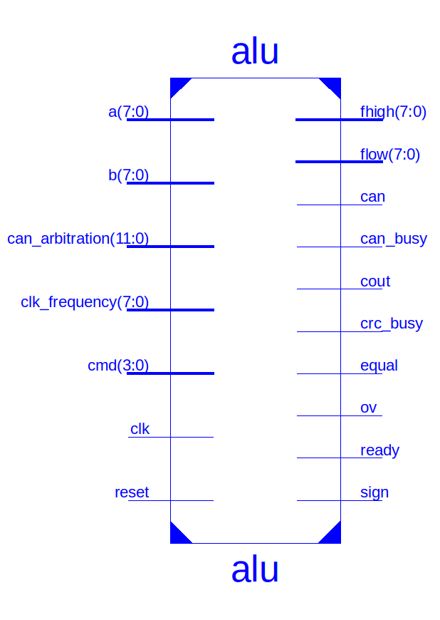

# VHDL ALU + CAN - Datenblatt

_Gruppe: Ben Bekir Ertugrul, Frederik Höft, Manuele Waldheim und Henri Betz_
_Ziel: Maximale Timingperformance_

Dieses Dokument liefert eine kurze technische Übersicht der VHDL-ALU und des CAN-Controllers. Es ist als Ergänzung zur README gedacht und enthält Informationen, die für die Nutzung der ALU und des CAN-Controllers relevant sind, ggf. aber nicht weiter auf Design-Entscheidungen eingehen. Für weitere Informationen zu Design-Entscheidungen und Implementierungsdetails wird auf die README verwiesen. Konkrete Informationen zu den VHDL-Modulen sind in den jeweiligen VHDL-Dateien zu finden.

## Eigenschaften

Die ALU arbeitet auf 8-Bit Eingaben und liefert 8 bis 16-Bit Ausgaben, je nach Operation. Operationen werden über 4-Bit Microcode Wörter gesteuert. Die maximale Taktfrequenz wurde mit Xilinx ISE für Xilinx Spartan-3E (XC3S500E-VQ100) FPGAs durch Post-Route-Timing Analysen ermittelt und liegt für die ALU bei 140.449 MHz, bzw 7.120 ns pro Taktzyklus. Der erwartete gesamt-Stromverbraucht beträgt 141.99 mW. Weitere Informationen zur Leistungsaufnahme sind unter [Power Consumption](#power-consumption) zu finden.

## Portdefinitionen

| Portname | Breite | Richtung | Common Name  | Anmerkungen |
|----------|--------|----------|--------------|--------------|
| `clk`      | 1      | Eingang  | Taktsignal   | < 140.449 MHz rising edge 50% duty cycle |
| `reset`    | 1      | Eingang  | Reset        | Synchroner Reset high-active Jegliche Operation (inklusive CAN Übertragung) wird gestoppt, muss bei Initialisierung gesetzt werden. Während Reset aktiv ist, werden alle weiteren Eingänge ignoriert. |
| `cmd`       | 4      | Eingang  | Operation    | 4-Bit Microcode Wort Opcodes werden nur akzeptiert, wenn `ready = '0'` ist. Eine Liste der unterstützten Operationen ist unter [Operationen](#operationen) zu finden. |
| `a`        | 8      | Eingang  | Operand A    | 8-Bit signed Operand A |
| `b`        | 8      | Eingang  | Operand B    | 8-Bit signed Operand B |
| `can_arbitration` | 12 | Eingang | CAN Arbitration | 12-Bit CAN Arbitration Field: - 11-Bit CAN ID - 1-Bit RTR (Remote Transmission Request) Bitorder: `ID[10:0] RTR` Weitere Informationen unter [Operationen](#operationen) |
| `clk_freqency` | 8 | Eingang | Clock Frequency | 8-Bit unsigned Clock Frequency in MHz Wird für CAN Bit Timing verwendet. Gibt die Taktfrequenz des `clk` Signals in MHz an. Werte sollten aufgerundet werden.  `0` ist reserviert und darf nicht verwendet werden. |
| `flow` | 8 | Ausgang | Result Low Byte | 8-Bit Low Byte des Ergebnisses MSB first Siehe [Operationen](#operationen) für weitere Informationen |
| `fhigh` | 8 | Ausgang | Result High Byte | 8-Bit High Byte des Ergebnisses MSB first Siehe [Operationen](#operationen) für weitere Informationen |
| `ready` | 1 | Ausgang | Ready | low-active `1`, wenn die ALU *nicht* bereit ist, eine weitere Operation auszuführen. Gibt an, dass im nächsten Taktzyklus das Ergebnis einer vorherigen Operation verfügbar ist. Wird ausschließlich als CRC-Interrupt für explizite CRC-Berechnungen verwendet. Wird nicht für CAN-Übertragungen verwendet. Wenn `ready = '1'`, werden keine weiteren Operationen erlaubt. |
| `crc_busy` | 1 | Ausgang | CRC Busy | high-active `1`, wenn die ALU eine CRC-Berechnung durchführt. Wenn `crc_busy = 1`, werden keine weiteren CRC, CAN, oder RAM Operationen erlaubt. Andere Operationen können weiterhin ausgeführt werden, solange andere Busy Signale dies erlauben. |
| `can_busy` | 1 | Ausgang | CAN Busy | high-active `1`, wenn die ALU eine CAN-Übertragung durchführt. Wenn `can_busy = 1`, werden keine weiteren CAN Operationen erlaubt. Andere Operationen können weiterhin ausgeführt werden, solange andere Busy Signale dies erlauben. |
| `can` | 1 | Ausgang | CAN TX | Serielles CAN Signal inklusive bit stuffing, SOF, und Interframe Space `1`, wenn idle Taktfrequenz: 1 MHz Die CRC-15 wird über CAN Header und Payload bebildet Weitere Informationen unter [Operationen](#operationen) |
| `cout` | 1 | Ausgang | Carry Out-Flag | high-active `1`, wenn ein Carry Out aufgetreten ist. Wird für Operationen verwendet, die ein Carry Out erzeugen können. Siehe [Operationen](#operationen) für weitere Informationen |
| `ov` | 1 | Ausgang | Overflow-Flag | high-active `1`, wenn ein Overflow aufgetreten ist. Wird für Operationen verwendet, die ein Overflow erzeugen können. Siehe [Operationen](#operationen) für weitere Informationen |
| `equal` | 1 | Ausgang | Equal-Flag | high-active `1`, wenn Operand A und Operand B Bit für Bit gleich sind. Wird in jedem Taktzyklus und Kontext aktualisiert. Unabhängig von Zustand, Busy signalen, oder Operationen.|
| `sign` | 1 | Ausgang | Sign-Flag | high-active `1`, wenn das Ergebnis negativ ist. Wird für Operationen verwendet, die ein Overflow erzeugen können. Siehe [Operationen](#operationen) für weitere Informationen |

## Operationen

Die ALU unterstützt 16 verschiedene Operationen, die über 4-Bit Microcode Wörter gesteuert werden. Die Operationen werden in der Reihenfolge der Opcodes aufgelistet. Die Opcodes sind in der Tabelle unter [Opcode Kurzreferenz](#opcode-kurzreferenz) zu finden. Die Operationen werden in der Tabelle unter [Operationen im Detail](#operationen-im-detail) beschrieben.

Um das Erstellen von Testvektoren zu vereinfachen, sind die Opcodes als *Preprozessor-Assembly (PPASM)* Befehle definiert, die von dem in der README beschriebenen C# Skript in die Opcodes übersetzt werden. Der Vollständigkeit halber werden diese PPASM Befehle im Folgenden ebenfalls aufgelistet, obwohl sie nicht direkt von der ALU interpretiert werden können.

### Opcode Kurzreferenz

| Opcode | PPASM | Operation | Common Name | Cycles |
|--------|-------|-----------|-------------|--------|
| `0000` | `add` | `flow[7:0] = a[7:0] + b[7:0]`   | [Addition](#addition) | 1 |
| `0001` | `sub` | `flow[7:0] = a[7:0] - b[7:0]`   | [Subtraktion](#subtraktion) | 1 |
| `0010` | `am2` | `flow[15:0] = (a<15:0> + b<15:0>) * 2` | [Add-Multiply by 2](#add-multiply-by-2) | 1 |
| `0011` | `am4` | `flow[15:0] = (a<15:0> + b<15:0>) * 4` | [Add-Multiply by 4](#add-multiply-by-4) | 1 |
| `0100` | `neg` | `flow[7:0] = -a[7:0]` | [Negation](#negation) | 1 |
| `0101` | `shl` | `flow[7:0] = a[7:0] << 1` | [Arithmetic Shift Left](#arithmetic-shift-left) | 1 |
| `0110` | `shr` | `flow[7:0] = a[7:0] >> 1` | [Arithmetic Shift Right](#arithmetic-shift-right) | 1 |
| `0111` | `rol` | `flow[7:0] = a[7:0] <<< 1` | [Rotate Left](#rotate-left) | 1 |
| `1000` | `ror` | `flow[7:0] = a[7:0] >>> 1` | [Rotate Right](#rotate-right) | 1 |
| `1001` | `mul` | `flow[15:0] = a[7:0] * b[7:0]` | [Multiplication](#multiplication) | 1 |
| `1010` | `nand` | `flow[7:0] = ~(a[7:0] & b[7:0])` | [NAND](#nand) | 1 |
| `1011` | `xor` | `flow[7:0] = a[7:0] ^ b[7:0]` | [XOR](#xor) | 1 |
| `1100` | `mov` | `RAM[b[7:0]] = a[7:0]` | [Move](#move) | 1 |
| `1101` | `crc` | `flow[15:0] = pad0(CRC15(RAM[a[7:0]..b[7:0]]))` | [CRC-15](#crc-15) | 2* |
| `1110` | `can` | `can <- CAN(<can_arbitration>, RAM[a[7:0]..b[7:0]], CRC[14:0])` | [CAN TX](#can-tx) | 1* |
| `1111` | `nop` | - | [Reserved (NOP)](#reserved-nop) | 1 |

### Operationen im Detail
#### Addition

| Code | PPASM | Operation | Precondition | Flags | Cycles |
|--------|-------|-----------|-------------|-----------------|-------|
| `0000` | `add` | `flow[7:0] = a[7:0] + b[7:0]`   | `ready = 0` | `cout`, `ov`, `equal`, `sign` | 1 |

Der Wert von Operand A wird mit dem Wert von Operand B addiert. Das Ergebnis wird in `flow` gespeichert, wobei `fhigh` undefiniert ist. Die Flags werden wie folgt gesetzt:

- `cout`: `1`, wenn ein carry von Bit 7 nach Bit 8 aufgetreten ist, `0` sonst.
- `ov`: `1`, wenn ein signed overflow aufgetreten ist, `0` sonst.
- `equal`: `1`, wenn Operand A und Operand B Bit für Bit gleich sind, `0` sonst.
- `sign`: `1`, wenn das Ergebnis negativ ist, `0` sonst.

#### Subtraktion

| Code | PPASM | Operation | Precondition | Flags | Cycles |
|--------|-------|-----------|-------------|-----------------|-------|
| `0001` | `sub` | `flow[7:0] = a[7:0] - b[7:0]`   | `ready = 0` | `cout`, `ov`, `equal`, `sign` | 1 |

Der Wert von Operand A wird von dem Wert von Operand B subtrahiert. Das Ergebnis wird in `flow` gespeichert, wobei `fhigh` undefiniert ist. Die Flags werden wie folgt gesetzt:

- `cout`: `1`, wenn ein borrow von Bit 7 nach Bit 8 aufgetreten ist, `0` sonst. 
  Im Allgemeinen ist `cout = 1` $\iff$ `unsigned(a) < unsigned(b)`.
- `ov`: `1`, wenn ein signed overflow aufgetreten ist, `0` sonst.
- `equal`: `1`, wenn Operand A und Operand B Bit für Bit gleich sind, `0` sonst.
- `sign`: `1`, wenn das Ergebnis negativ ist, `0` sonst.

#### Add-Multiply by 2

| Code | PPASM | Operation | Precondition | Flags | Cycles |
|--------|-------|-----------|-------------|-----------------|-------|
| `0010` | `am2` | `flow[15:0] = (a<15:0> + b<15:0>) * 2` | `ready = 0` | `equal`, `sign` | 1 |

Operanden A und B werden mit Sign-Extension auf 16-Bit erweitert. Die Werte werden addiert und das Ergebnis wird mit 2 multipliziert. Das Low Byte des Ergebnisses wird in `flow` gespeichert, das High Byte in `fhigh`. Die Flags werden wie folgt gesetzt:

- `equal`: `1`, wenn Operand A und Operand B Bit für Bit gleich sind, `0` sonst.
- `sign`: `1`, wenn das Ergebnis negativ ist, `0` sonst.

16-Bit Overflows oder Carries können nicht auftreten, `cout` und `ov` sind immer `0`.

#### Add-Multiply by 4

| Code | PPASM | Operation | Precondition | Flags | Cycles |
|--------|-------|-----------|-------------|-----------------|-------|
| `0011` | `am4` | `flow[15:0] = (a<15:0> + b<15:0>) * 4` | `ready = 0` | `equal`, `sign` | 1 |

Operanden A und B werden mit Sign-Extension auf 16-Bit erweitert. Die Werte werden addiert und das Ergebnis wird mit 4 multipliziert. Das Low Byte des Ergebnisses wird in `flow` gespeichert, das High Byte in `fhigh`. Die Flags werden wie folgt gesetzt:

- `equal`: `1`, wenn Operand A und Operand B Bit für Bit gleich sind, `0` sonst.
- `sign`: `1`, wenn das Ergebnis negativ ist, `0` sonst.

16-Bit Overflows oder Carries können nicht auftreten, `cout` und `ov` sind immer `0`.

#### Negation

| Code | PPASM | Operation | Precondition | Flags | Cycles |
|--------|-------|-----------|-------------|-----------------|-------|
| `0100` | `neg` | `flow[7:0] = -a[7:0]` | `ready = 0` | `cout`, `ov`, `sign` | 1 |

Der Wert von Operand A wird negiert. Das Ergebnis wird in `flow` gespeichert, wobei `fhigh` undefiniert ist. Die Flags werden wie folgt gesetzt:

- `sign`: `1`, wenn das Ergebnis negativ ist, `0` sonst.
- `cout`: `1`, wenn das Ergebnis negativ ist, `0` sonst. (`cout = sign`).
- `ov`: `1`, wenn Operand A gleich dem Minimum Wert von 8-Bit signed Integern ist, `0` sonst. (`ov = (a == -128)`).

`equal` ist undefiniert.

#### Arithmetic Shift Left

| Code | PPASM | Operation | Precondition | Flags | Cycles |
|--------|-------|-----------|-------------|-----------------|-------|
| `0101` | `shl` | `flow[7:0] = a[7:0] << 1` | `ready = 0` | `sign` | 1 |

Der Wert von Operand A wird um 1 Bit nach links geshiftet. Bit 0 wird mit `0` aufgefüllt. Das Ergebnis wird in `flow` gespeichert, wobei `fhigh` undefiniert ist. Die Flags werden wie folgt gesetzt:

- `sign`: `1`, wenn das Ergebnis negativ ist, `0` sonst.

`cout` und `ov` sind immer `0`. `equal` ist undefiniert.

#### Arithmetic Shift Right

| Code | PPASM | Operation | Precondition | Flags | Cycles |
|--------|-------|-----------|-------------|-----------------|-------|
| `0110` | `shr` | `flow[7:0] = a[7:0] >> 1` | `ready = 0` | `sign` | 1 |

Der Wert von Operand A wird um 1 Bit nach rechts geshiftet. Bit 7 wird mit dem Wert des Sign-Bits aufgefüllt. Das Ergebnis wird in `flow` gespeichert, wobei `fhigh` undefiniert ist. Die Flags werden wie folgt gesetzt:

- `sign`: `1`, wenn das Ergebnis negativ ist, `0` sonst.

`cout` und `ov` sind immer `0`. `equal` ist undefiniert.

#### Rotate Left

| Code | PPASM | Operation | Precondition | Flags | Cycles |
|--------|-------|-----------|-------------|-----------------|-------|
| `0111` | `rol` | `flow[7:0] = a[7:0] <<< 1` | `ready = 0` | `sign` | 1 |

Der Wert von Operand A wird um 1 Bit nach links rotiert, sodass das MSB zum LSB wird. Das Ergebnis wird in `flow` gespeichert, wobei `fhigh` undefiniert ist. Die Flags werden wie folgt gesetzt:

- `sign`: `1`, wenn das Ergebnis negativ ist, `0` sonst.

`cout` und `ov` sind immer `0`. `equal` ist undefiniert.

#### Rotate Right

| Code | PPASM | Operation | Precondition | Flags | Cycles |
|--------|-------|-----------|-------------|-----------------|-------|
| `1000` | `ror` | `flow[7:0] = a[7:0] >>> 1` | `ready = 0` | `sign` | 1 |

Der Wert von Operand A wird um 1 Bit nach rechts rotiert, sodass das LSB zum MSB wird. Das Ergebnis wird in `flow` gespeichert, wobei `fhigh` undefiniert ist. Die Flags werden wie folgt gesetzt:

- `sign`: `1`, wenn das Ergebnis negativ ist (d.h. das LSB von Operand A ist `1`), `0` sonst.

`cout` und `ov` sind immer `0`. `equal` ist undefiniert.

#### Multiplication

| Code | PPASM | Operation | Precondition | Flags | Cycles |
|--------|-------|-----------|-------------|-----------------|-------|
| `1001` | `mul` | `flow[15:0] = a[7:0] * b[7:0]` | `ready = 0` | `equal`, `sign` | 1 |

Der Wert von Operand A wird mit dem Wert von Operand B multipliziert. Das 16-Bit Ergebnis wird in `flow` und `fhigh` gespeichert. Die Flags werden wie folgt gesetzt:

- `equal`: `1`, wenn Operand A und Operand B Bit für Bit gleich sind, `0` sonst.
- `sign`: `1`, wenn das Ergebnis negativ ist, `0` sonst.

16-Bit Overflows oder Carries können nicht auftreten, `cout` und `ov` sind immer `0`.

#### NAND

| Code | PPASM | Operation | Precondition | Flags | Cycles |
|--------|-------|-----------|-------------|-----------------|-------|
| `1010` | `nand` | `flow[7:0] = ~(a[7:0] & b[7:0])` | `ready = 0` | `equal`, `sign` | 1 |

Der Wert von Operand A wird mit dem Wert von Operand B bitweise ge-NAND-et. Das Ergebnis wird in `flow` gespeichert, wobei `fhigh` undefiniert ist. Die Flags werden wie folgt gesetzt:

- `equal`: `1`, wenn Operand A und Operand B Bit für Bit gleich sind, `0` sonst.
- `sign`: `1`, wenn das Ergebnis negativ ist, `0` sonst.

`cout` und `ov` sind immer `0`.

#### XOR

| Code | PPASM | Operation | Precondition | Flags | Cycles |
|--------|-------|-----------|-------------|-----------------|-------|
| `1011` | `xor` | `flow[7:0] = a[7:0] ^ b[7:0]` | `ready = 0` | `equal`, `sign` | 1 |

Der Wert von Operand A wird mit dem Wert von Operand B bitweise ge-XOR-et. Das Ergebnis wird in `flow` gespeichert, wobei `fhigh` undefiniert ist. Die Flags werden wie folgt gesetzt:

- `equal`: `1`, wenn Operand A und Operand B Bit für Bit gleich sind, `0` sonst.
- `sign`: `1`, wenn das Ergebnis negativ ist, `0` sonst.

`cout` und `ov` sind immer `0`.

#### Move

| Code | PPASM | Operation | Precondition | Flags | Cycles |
|--------|-------|-----------|-------------|-----------------|-------|
| `1100` | `mov` | `RAM[b[7:0]] = a[7:0]` | `ready = 0`, `crc_busy = 0` | | 1 |

Der Wert von Operand A wird in den RAM an der in Operand B angegebenen Adresse geschrieben. Die Operation kann nicht ausgeführt werden, wenn die ALU gerade eine CRC-Berechnung durchführt. `flow` und `fhigh` sind `0`. `cout`, `ov`, und `sign` sind `0`. `equal` ist undefiniert.

#### CRC-15

| Code | PPASM | Operation | Precondition | Flags | Cycles |
|--------|-------|-----------|-------------|-----------------|-------|
| `1101` | `crc` | `flow[15:0] = pad0(CRC15(RAM[a[7:0]..b[7:0]]))` | `ready = 0`, `crc_busy = 0` | `crc_busy`, `ready`, `equal` | 2* |

**Die Operation benötigt 1 Taktzyklus, um die Berechnung zu starten, arbeitet anschließend im Hintergrund, und benötigt 1 Taktzyklus, um das Ergebnis zurückzugeben. Die gesamte Dauer zwischen Start und Ergebnis hängt von der Größe des RAM Bereichs ab und beträgt `2 + b - a` Taktzyklen.*

Die CRC-15 Prüfsumme des RAM Bereichs zwischen Adressen A und B wird berechnet, wobei gelten muss, dass `a <= b`. Nach Start der Berechnung wird `crc_busy` auf `1` gesetzt und die ALU ist für weitere CRC-Berechnungen gesperrt. Andere Operationen können weiterhin ausgeführt werden, solange andere Busy Signale dies erlauben. Das Ergebnis wird nach Ende der Berechnung in `flow` und `fhigh` gespeichert, wobei das MSB in `fhigh` durch Padding mit `0` aufgefüllt wird. Ein Taktzyklus vor Ende der Berechnung wird `ready` auf `1` gesetzt, um einen CRC-Interrupt zu signalisieren, der die CPU über das Ende der Berechnung informiert, und dass im folgenden Taktzyklus `flow` und `fhigh` das Ergebnis enthalten und somit nicht für andere Operationen verwendet werden können. Die Flags werden wie folgt gesetzt:

- `crc_busy`: `1`, solange die ALU eine CRC-Berechnung durchführt, `0` sonst.
- `ready`: `1`, wenn die ALU eine CRC-Berechnung durchführt und das Ergebnis im nächsten Taktzyklus verfügbar ist, `0` sonst.
- `equal`: `1`, wenn Start- und Endadresse gleich sind, `0` sonst.

`cout` und `ov` sind immer `0`. `sign`, `flow`, und `fhigh` sind undefiniert.

#### CAN TX

| Code | PPASM | Operation | Precondition | Flags | Cycles |
|--------|-------|-----------|-------------|-----------------|-------|
| `1110` | `can` | `CAN(<can_arbitration>, RAM[a[7:0]..b[7:0]], CRC[14:0])` | `ready = 0`, `can_busy = 0`, `crc_busy = 0` | `can_busy`, `crc_busy` | 1* |

**Die Operation benötigt 1 Taktzyklus, um die Übertragung zu starten, und arbeitet anschließend im Hintergrund. Die Dauer der Übertragung hängt von der Länge der Nachricht und der Taktfrequenz ab.*

Die CAN Nachricht mit der in `can_arbitration` angegebenen Arbitration ID und den Daten aus dem RAM zwischen Adressen `a` und `b` wird gesendet. Nach Start der Übertragung wird `can_busy` auf `1` gesetzt und die ALU ist für weitere CAN-Übertragungen gesperrt. Andere Operationen können weiterhin ausgeführt werden, solange andere Busy Signale dies erlauben.

##### CAN PHY-Provider / CAN Controller

Der CAN PHY-Provider / CAN-Controller buffert CAN-Header und -Daten und sendet diese mit der einem CAN Bit Timing von 1 MHz seriell über den `can` Ausgang. Die dafür notwendige Frequenz wird basierend auf der angegebenen Clock Frequenz (`clk_frequency`) berechnet. Die Ausführungsschritte sind wie folgt:

- Zyklus 0: "idle" Zustand
    - CPU legt Arbitrierungsfeld (CAN ID + RTR) über `can_arbitration` an, sowie CAN-Mikrocode-Befehl und Start-/Endadresse für die Daten über die jeweiligen Ports
    - ALU Flag-Update: `can_busy = 1`, `crc_busy = 1`
    - ALU bereitet CRC-Berechnung (Header + Daten) vor (CRC Initialisierung, Multiplexer, etc.)
    - ALU buffert Arbitrierungsfeld, Start-/Endadresse in speziellen internen Registern
    - ALU setzt CAN-Bufferstrobe = 1 (nächster Zyklus: Start der Datenübertragung an CAN-PHY-Provider)
  - Zyklus 1..3: "CAN-Buffering" Zustand
    - ALU erstellt und sendet CAN Header (24 Bits in 3 8-Bit Worten, einschließlich Padding mit '0'-Bits) an CAN-PHY-Provider, CAN-PHY-Provider buffert header in 88 Bit TX-Bufferspeicher
    - Gleichzeitige CRC-Berechnung des Header der an CAN-PHY-Provider übertragenen Wörter (Streaming CRC)
    - In Zyklus 2 berechnet die ALU den CAN Data Length Code aus den RAM Adressen und limitiert ggf. bei 8 Bytes. Der DLC wird als Teil von Wort 3 an das CAN-PHY-Provider übertragen.
    - In Zyklus 3 bereitet die ALU RAM-Zugriffe für die Datenübertragung vor (Adresse anlegen, RAM-steuerleitungen vorbereiten, etc.)
  - Zyklus 4..(4 + DLC): "CAN-CRC-Busy" Zustand
    - ALU leitet Daten von RAM an CAN-PHY-Provider weiter, CAN-PHY-Provider buffert Daten in TX-Bufferspeicher
    - Gleichzeitige CRC-Berechnung (Daten) der an CAN-PHY-Provider gepufferten Wörter (Streaming CRC)
    - Vorletzter Zyklus:
      - ALU setzt CAN-CRC-Strobe = 1 (nächster Zyklus: CRC-Ergebnis kann im nächsten Zyklus von CAN-PHY-Provider übernommen werden)
    - Letzter Zyklus:
      - ALU meldet `crc_busy = 0` (neue CRC-Berechnung kann im nächsten Zyklus gestartet werden)
      - CAN-PHY liest CRC-Ergebnis und speichert es in internem Register
  - Zyklus 5 + DLC: "CAN-NOP-Zyklus"
    - CAN-PHY-Provider wechselt von Mealy (optimiert für reduzierte Zyklen während des Buffern) zu Moore-FSM ("Übertragungs"-Modus)
    - CAN-PHY bereitet interne Zähler, Stuffing-Logik und serielle Übertragung vor
  - Zyklus 6 + DLC.. "CAN-Übertragung" Zustand
    - CAN-PHY reduziert die eigene Taktfrequenz auf 1 MHz und startet die serielle Übertragung: 
      `SOF <can_arbitration> IDE r0 DLC RAM[a[7:0]..b[7:0]] CRC[14:0] CRC_Delimiter ACK ACK_Delimiter EOF IFS`

Nach Zyklus 0 (unmittelbar nach dem Versenden des CAN-Mikrocode-Befehls) ist die ALU bereit, jeden neuen Befehl zu akzeptieren, der nicht CAN, RAM oder CRC betrifft. `can` wird als nicht blockierende Operation betrachtet.

#### Reserved (NOP)

| Code | PPASM | Operation | Precondition | Flags | Cycles |
|--------|-------|-----------|-------------|-----------------|-------|
| `1111` | `nop` | - | `ready = 0` | | 1 |

Die Operation ist reserviert für zukünftige Erweiterungen. Sie kann als NOP verwendet werden, aber es wird nicht garantiert, dass sie in zukünftigen Versionen der ALU weiterhin als NOP fungiert. `flow` und `fhigh` sind `0`. `cout`, `ov`, `sign`, und `equal` sind undefiniert.

## Macro Statistics
| Bauteil | Details | Anzahl | Anmerkungen |
|---------|--------|-------------|----------- |
| FSMs | | 2 | ALU FSM CAN TX FSM |
| Multipliers | 8x8-bit registered multiplier  | 1 | ALU Multiplikation |
| Adders/Subtractors | 16-bit adder 16-bit addsub 2-bit subtractor 4-bit adder 4-bit subtractor (2x) 7-bit subtractor 8-bit adder (2x) 8-bit subtractor 9-bit adder (2x)  | 12 | ALU Operationen und Pointerarithmetik |
| Counters | 4-bit down counter | 1 | |
| Registers | Flip-Flops | 212 | *Unser Designziel war Timing Performance, nicht Area, oder Umweltfreundlichkeit.* :upside_down_face:
| Comparators | 16-bit comparator equal 16-bit comparator greater 16-bit comparator less 7-bit comparator equal 8-bit comparator equal 8-bit comparator greater 8-bit comparator less (2x) 9-bit comparator equal 9-bit comparator greatequal 9-bit comparator greater  | 11 | Verschiedenste Bausteine für Flags, Pointerarithmetik, etc. |
| Multiplexers | 1-bit 83-to-1 multiplexer | 1 | CAN Header/Daten-register nach Output-Multiplexer |
| Xors | 1-bit xor2 (14x) 1-bit xor3 (7x) 1-bit xor4 (6x) 1-bit xor5 (2x) 16-bit xor2 | 30 | |

## Power Consumption

### On-Chip Power Summary

|        On-Chip        | Power (mW) |  Used  | Available | Utilization (%) |
|-----------------------|------------|--------|-----------|-----------------|
| Clocks                |       7.93 |      1 |    ---    |       ---       |
| Logic                 |       5.71 |    517 |      9312 |               6 |
| Signals               |      10.47 |    726 |    ---    |       ---       |
| IOs                   |      34.37 |     66 |        66 |             100 |
| BRAMs                 |       0.52 |      1 |        20 |               5 |
| MULTs                 |       0.27 |      1 |        20 |               5 |
| Static Power          |      82.72 |        |           |                 |
| Total                 |     141.99 |        |           |                 |

### Power Supply Summary

|                      | Total  | Dynamic | Static Power |
|----------------------|--------|---------|--------------|
| Supply Power (mW)    | 141.99 | 59.27   | 82.72        |

### Power Supply Currents

|     Supply Source     | Supply Voltage | Total Current (mA) | Dynamic Current (mA) | Quiescent Current (mA) |
|-----------------------|----------------|--------------------|----------------------|------------------------|
| Vccint                |          1.200 |              49.07 |                21.81 |                  27.26 |
| Vccaux                |          2.500 |              18.69 |                 0.69 |                  18.00 |
| Vcco25                |          2.500 |              14.56 |                12.56 |                   2.00 |
