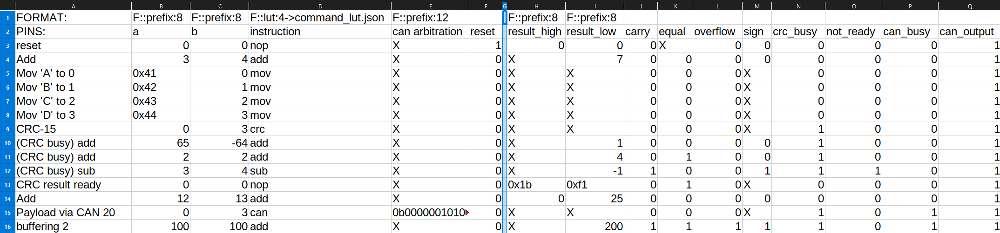

# VHDL ALU + CAN

_Gruppe: Ben Bekir Ertugrul, Frederik Höft, Manuele Waldheim und Henri Betz_
_Ziel: Maximale Timingperformance_

Dieses Dokument dient als Übersicht der erbrachten Leistungen innerhalb des dritten (und letzten) VHDL-Projektes.

## Beschreibung des Projektes

TODO

### Implementierungsdetails / Besonderheiten

TODO

## Aktualisierter Test-Preprocessor

_Den source code finden Sie in `/csharp-comment-parser/src`. Pre-compiled executables für Windows/Linux x64 sind verfügbar in der [GitHub Releases](https://github.com/frederik-hoeft/fhdw-vhdl-alu-can/releases)._

Das in den vorangangenen VHDL Projekten erstellte C\#/.NET Programm, welches zur vereinfachten Erstellung von Testvektoren gedient hat, wurde nun erweitert und erneut genutzt. Die bestehende Implementierung erlaubte bereits, Testvektoren in angegebenen Formaten (Binär, Hexadezimal, Dezimal) zusammen mit Kommentaren in einer CSV Datei zu definieren und die Stimuli-Response Dateien zu generieren. Die neue Version erweitert die Datenformate um dynamische Präfix-basierte Spaltendefinitionen, sowie die Möglichkeit, Lookup-Tabellen für textuelle Daten zu definieren.

### Angepasste CSV Struktur

Damit das C\#-Programm die Testdaten erfolgreich verarbeiten kann, wird der Aufbau der CSV Datei wie folgt vorgeschrieben:
- Die erste Zeile beinhaltet Definitionen der zu verwendenden Formatierung und Wortbreiten für die jeweiligen Spalten in denen sie stehen. Entweder werden sowohl Zahlensystem als auch Wortbreite definiert, oder es wird keine Definition angegeben.
    - Folgende Formatierungscodes sind verfügbar:
        - `F::base_2:<length>` - Daten dieser Spalte werden als Binärzahlen mit der angegebenen Wortbreite interpretiert.
        - `F::base_10:<length>` - Daten dieser Spalte werden als Dezimalzahlen mit der angegebenen Wortbreite interpretiert.
        - `F::base_16:<length>` - Daten dieser Spalte werden als Hexadezimalzahlen mit der angegebenen Wortbreite interpretiert.
        - `F::prefix:<length>` - Daten dieser Spalte werden basierend auf dem Präfix als Binär-, Dezimal-, oder Hexadezimalzahlen mit der angegebenen Wortbreite interpretiert. Folgende Präfixe sind verfügbar:
            - `0b` - Binär
            - `0x` - Hexadezimal
            - keine Präfixe - Dezimal
        - `F::lut:<length>-><filename>.json` - Daten dieser Spalte werden als Text interpretiert und mit der angegebenen Lookup-Tabelle in der angegebenen JSON Datei übersetzt. Die JSON Datei muss im selben Ordner wie die CSV Datei liegen. Die angegebene Lookup-Tabelle muss folgendes Key-Value Format haben:
            ```json
            { // key:  value
                "add": "0000",
                "sub": "0001",
                ...
                "nop": "1111"
            }
            ```
            Die Lookup-Tabelle muss ein JSON-Objekt sein, welches nur Strings als Werte enthält. Die Schlüssel können beliebig sein, die Werte müssen jedoch Binärzahlen sein, welche der Wortbreite der Spalte entsprechen.
    - Wenn der Inhalt einer Spalte nicht definiert wird, ist angenommen, dass der Spalteninhalt immer genau ein Bit repräsentiert.
- Die erste Spalte kann für Kommentare o.Ä. verwendet werden. (Die Spaltendefinitionen fangen erst ab Spalte 2 an!)
- Die zweite Zeile kann für Kommentare (Spaltennamen / Signalnamen) o.Ä. verwendet werden.
- Die Input-Daten fangen ab Zeile 3 Spalte 2 an. Für jedes Input-Feld wird eine neue Spalte hinzugefügt.
- Die Output-Daten werden durch eine leere Spalte von den Input-Daten getrennt. Für jedes Output-Feld wird eine neue Spalte hinzugefügt.
- Ein Input-Output-Datenpaar steht in einer Zeile.

Der erwartete Inhalt der Input- und Output-Abschnitte kann sich wie oben erwähnt von Spalte zu Spalte ändern. Entweder werden Werte einer Spalte passend zu der Definition der Spalte, oder, falls keine Definition vorhanden, ein Bit erwartet.
Unabhängig von der Spaltendefinition kann IMMER ein "X" in einer Zelle stehen, welches als Don't Care der angegebenen Wortbreite interpretiert wird.

Der folgende Bildschirmausschnitt veranschaulicht die oben beschriebene Struktur anhand der von uns verwendeten Testvektoren:



Die markierte Spalte (G) entspricht in diesem Fall der Leerspalte zwischen Inputs und erwarteten Outputs.

### TXT Struktur

Pro CSV Datei werden zwei TXT Dateien erstellt. Eine Datei beinhaltet die Input-Felder und eine Datei beinhaltet die Output-Felder. Daten in verschiedenen Spalten werden durch Leerzeichen separiert. Die Daten werden unter Beeinhaltung der angegebenen Reihenfolge kopiert, jedoch wird der letzte Input-Datensatz, sowie der erste Output-Datensatz zwei Mal eingefügt, da die ALU die eingehenden Daten zunächst in ein Register lädt, bevor sie verarbeitet werden.

Die generierten TXT Dateien können direkt in die Testbench eingefügt werden. Folgender Ausschnitt zeigt die generierten Dateien für die oben gezeigten Testvektoren:

<div style="display: grid; grid-template-columns: 49% 49%; grid-column-gap: 2%">
<div>

Input:

```txt
00000000 00000000 1111 ------------ 1
00000011 00000100 0000 ------------ 0
01000001 00000000 1100 ------------ 0
01000010 00000001 1100 ------------ 0
01000011 00000010 1100 ------------ 0
01000100 00000011 1100 ------------ 0
00000000 00000011 1101 ------------ 0
01000001 11000000 0000 ------------ 0
00000010 00000010 0000 ------------ 0
00000011 00000100 0001 ------------ 0
00000000 00000000 1111 ------------ 0
00001100 00001101 0000 ------------ 0
00000000 00000011 1110 000000101000 0
01100100 01100100 0000 ------------ 0
...
```

</div>
<div>

Expected Output:

```txt
-------- -------- - - - - - - - -
00000000 00000000 0 - 0 0 0 0 0 1
-------- 00000111 0 0 0 0 0 0 0 1
-------- -------- 0 0 0 - 0 0 0 1
-------- -------- 0 0 0 - 0 0 0 1
-------- -------- 0 0 0 - 0 0 0 1
-------- -------- 0 0 0 - 0 0 0 1
-------- -------- 0 0 0 - 1 0 0 1
-------- 00000001 0 0 0 0 1 0 0 1
-------- 00000100 0 1 0 0 1 0 0 1
-------- 11111111 1 0 0 1 1 1 0 1
00011011 11110001 0 1 0 - 0 0 0 1
00000000 00011001 0 0 0 0 0 0 0 1
-------- -------- 0 0 0 - 1 0 1 1
...
```

</div>
</div>

## Implementierung der Testbench

TODO